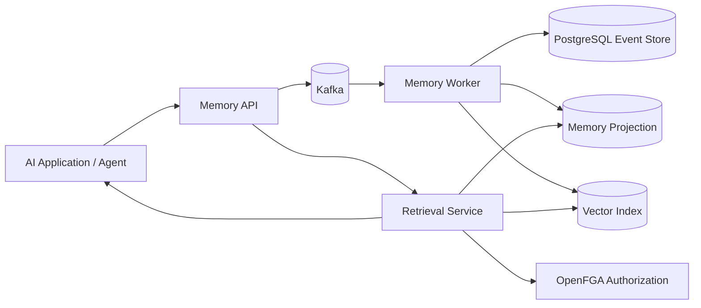

# MemoryMesh

MemoryMesh is a distributed memory infrastructure platform for AI applications.

It is not a chatbot and not a thin RAG wrapper. The goal is to build the infrastructure layer that AI applications can use to store, update, retrieve, authorize, observe, and reason over long-lived memory.

## Why this project exists

Most AI applications treat memory as an implementation detail: embed text, store vectors, retrieve chunks. That is too shallow for real systems.

Production AI memory needs:

- event history
- source provenance
- confidence scoring
- hybrid retrieval
- authorization
- deletion and archival
- observability
- failure recovery
- scale testing

MemoryMesh is designed to demonstrate backend, distributed systems, AI infrastructure, and Staff-level engineering judgment.

## MVP Scope: 2 Weeks

The MVP is complete when MemoryMesh can:

1. Accept memory events through an API.
2. Publish events to Kafka.
3. Persist immutable memory events to PostgreSQL.
4. Build a current memory projection.
5. Retrieve memories using hybrid retrieval: semantic + keyword + recency.
6. Explain retrieval decisions enough for debugging.

No UI. No chatbot. No agent framework. No unnecessary frontend.

## 2-Month Roadmap

| Phase | Timeline | Goal |
|---|---:|---|
| Architecture | Days 1-2 | RFC, diagrams, tradeoffs, scope |
| Local infra | Days 2-4 | Docker Compose, Postgres, Kafka, OpenFGA |
| Event model | Days 4-6 | Memory event schema and persistence |
| Ingestion | Week 2 | Kafka producer/consumer pipeline |
| Retrieval MVP | End Week 2 | Hybrid retrieval API |
| Authorization | Week 3 | OpenFGA model and enforcement |
| Benchmarking | Weeks 4-5 | Synthetic data, latency, throughput |
| Resilience | Week 6 | failure tests and recovery docs |
| Observability | Week 7 | logs, metrics, traces, dashboards |
| Case study | Week 8 | final architecture and interview guide |

## Core Architecture



## Repository Structure

```text
memorymesh/
├── cmd/                       # service entrypoints
├── internal/                  # Go internal packages
├── migrations/                # database migrations
├── deployments/               # docker compose and infra config
├── docs/
│   ├── rfc/                   # architecture RFCs
│   ├── adr/                   # architecture decision records
│   ├── diagrams/              # system diagrams
│   └── case-study/            # final interview-ready writeup
├── benchmarks/                # synthetic load and benchmark tooling
└── scripts/                   # local dev scripts
```

## Engineering Principles

1. Every major decision must have a written reason.
2. Prefer boring infrastructure over trendy abstractions.
3. Build for debuggability before scale.
4. Measure claims. Do not hand-wave performance.
5. Failure behavior is part of the product.

## What this project should prove

By the end, this repository should prove that the builder can discuss:

- event sourcing
- Kafka ingestion
- idempotency
- PostgreSQL schema design
- hybrid retrieval
- authorization modeling
- observability
- reliability testing
- scaling tradeoffs
- architecture documentation

The final outcome is not just working code. The final outcome is an interview-quality system design artifact backed by real implementation.