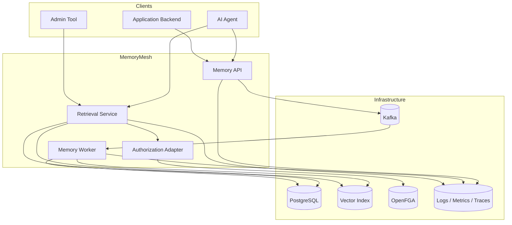
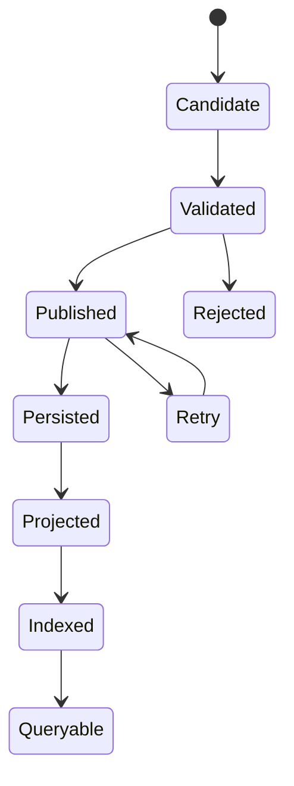
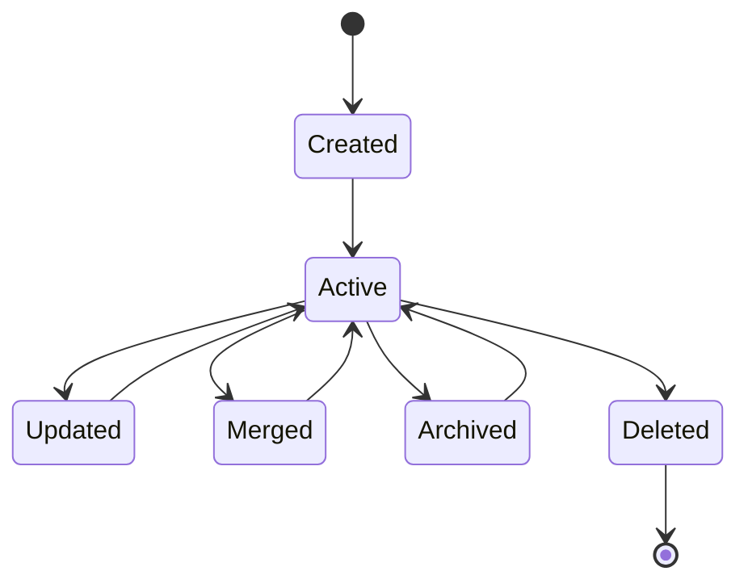
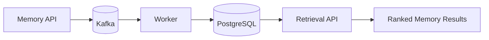

# System Context Diagrams

## Component View

## Event Lifecycle

## Memory Lifecycle

## Two-Week MVP Boundary

The MVP should stop here. Do not add UI, agent orchestration, SaaS billing, or unnecessary product features before the backend system is demonstrably reliable.