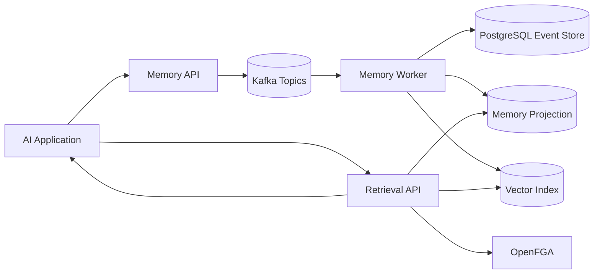

# RFC 0001: MemoryMesh Architecture

## Status

Draft

## Context

MemoryMesh is a distributed memory infrastructure platform for AI applications. It stores memory as events, builds queryable projections, retrieves relevant memory, and enforces access control.

## Problem Statement

Build a memory infrastructure layer that can:

- ingest memory events
- preserve immutable event history
- maintain queryable projections
- support hybrid retrieval
- enforce multi-tenant access control
- expose operational metrics

## Non-Goals

MemoryMesh will not build a chatbot UI, frontend dashboard, full agent framework, or generic vector database during the MVP.

## Core Architecture



## Write Path

1. Application submits a memory candidate.
2. API validates the request.
3. API publishes a memory event to Kafka.
4. Worker consumes the event.
5. Worker persists the immutable event.
6. Worker updates the projection and vector index.

## Read Path

1. Application submits a retrieval request.
2. Retrieval API checks access permissions.
3. Service performs semantic, keyword, and recency search.
4. Results are ranked and returned.

## Data Model

### memory_events

| Field | Purpose |
|---|---|
| id | unique event id |
| tenant_id | organization boundary |
| subject_id | entity memory belongs to |
| memory_id | logical memory id |
| event_type | created, updated, merged, archived, deleted |
| payload | event-specific data |
| confidence | reliability score |
| source_type | conversation, document, API, manual |
| source_ref | pointer to source |
| occurred_at | source event time |
| created_at | ingestion time |

### memory_projection

| Field | Purpose |
|---|---|
| memory_id | logical memory id |
| tenant_id | organization boundary |
| subject_id | entity memory belongs to |
| key | normalized attribute or fact key |
| value | current memory value |
| confidence | current confidence |
| status | active, archived, deleted |
| last_event_id | latest event applied |
| updated_at | projection update time |

## Retrieval Strategy

MVP retrieval should combine semantic search, keyword search, recency scoring, confidence scoring, and access control checks.

Initial score:

```text
final_score = semantic_score * 0.45
            + keyword_score  * 0.25
            + recency_score  * 0.15
            + confidence     * 0.15
```

## Consistency Model

MemoryMesh should use eventual consistency between ingestion and retrieval. Kafka decouples write acceptance from projection updates. The API should expose projection lag and last applied event metadata.

## MVP Acceptance Criteria

The MVP is complete when:

- local stack starts with one command
- memory events can be submitted through API
- events flow through Kafka
- events are persisted immutably
- current memory projection is queryable
- retrieval combines semantic, keyword, and recency ranking
- docs explain architecture and tradeoffs

## Open Questions

- Should vector index be pgvector initially or a separate vector DB?
- How much conflict resolution should be automatic in MVP?
- Should retrieval authorization be pre-filter or post-filter?
- Should memory merging be synchronous or asynchronous?